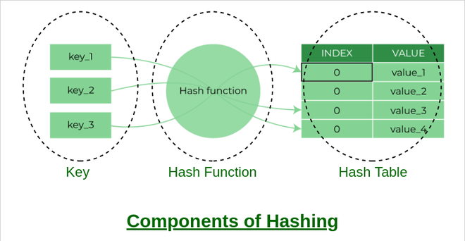

# Hashing Concept

## What is Hashing?

Hashing refers to the process of generating a fixed-size output from an input of variable size.
This technique determines an index or location for the storage of an item in a data structure.

## Need for Hash data structure

Data structure that can store the data and search in it in constant time, i.e. in O(1) time

## Components of Hashing

1. Key: A Key can be anything string or integer which is fed as input in the hash function the technique that determines an index or location for storage of an item in a data structure. 

2. Hash Function: The hash function receives the input key and returns the index of an element in an array called a hash table. The index is known as the hash index.

3. Hash Table: Hash table is a data structure that maps keys to values using a special function called a hash function. Hash stores the data in an associative manner in an array where each data value has its own unique index.

## What is Collision?

The hashing process generates a small number for a big key, so there is a possibility that two keys could produce the same value. The situation where the newly inserted key maps to an already occupied, and it must be handled using some collision handling technology.

## Advantages of Hashing in Data Structures
1. **Key-value support**: Hashing is ideal for implementing key-value data structures.
2. **Fast data retrieval**: Hashing allows for quick access to elements with constant-time complexity.
3. **Efficiency**: Insertion, deletion, and searching operations are highly efficient.
4. **Memory usage reduction**: Hashing requires less memory as it allocates a fixed space for storing elements.
5. **Scalability**: Hashing performs well with large data sets, maintaining constant access time.
6. **Security and encryption**: Hashing is essential for secure data storage and integrity verification.

## Reference

[What is hashing?](https://www.geeksforgeeks.org/what-is-hashing)